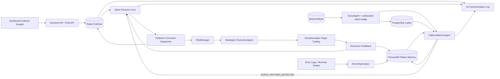

# QWEN-ORCHESTRATOR Architecture

Bu belge, Qwen 3.5-9B-Coder tabanli karar cekirdegi ile calisan moduler trading orkestrasyonunun veri akis iskeletini tarif eder.

## Katmanlar

1. Gozler
ScoutAgent, websocket-client tabanli opsiyonel bridge ve mevcut async websocket akislarini kullanarak trade tick'lerini toplar.

2. Pattern ve Bellek
PatternMatcherAgent, anlamli %2 hareketleri filtreler ve son 24 saatteki pattern snapshot'larini ChromaDB uzerinden sorgular.

3. Beyin
Qwen Decision Core, pattern olaylarini Pydantic JSON semasina donusturur, reasoning uretir ve agent komutlarini belirler.

4. Uzuvlar
Execution ve paper trading akisi mevcut strategist, risk manager ve ghost simulator uzerinden ilerler.

5. Gozlem ve Ogrenme
Redis Pub/Sub, dashboard loglari ve terminal hata akislarini ortak bir olay omurgasinda birlestirir. Sonuclar ChromaDB'ye deneyim olarak yazilir.

## Data Flow Diagram

## Ana Moduller

- python_agents/qwen_models.py: tum komut, event ve ogrenme semalari
- python_agents/redis_event_bus.py: Redis Pub/Sub koprusu
- python_agents/vector_memory.py: ChromaDB pattern ve deneyim hafizasi
- python_agents/cleanup_module.py: aktif olmayan model artefaktlarini temizleme mantigi
- python_agents/websocket_ingestion.py: websocket-client bazli bridge

## Operasyon Notlari

- Varsayilan execution mode paper trading olarak tutulur.
- Redis yoksa sistem local event bus ile degraded ama calisir durumda kalir.
- ChromaDB persistent path: python_agents/.chroma
- Qwen model adi ortam degiskenleri ile yonetilir.