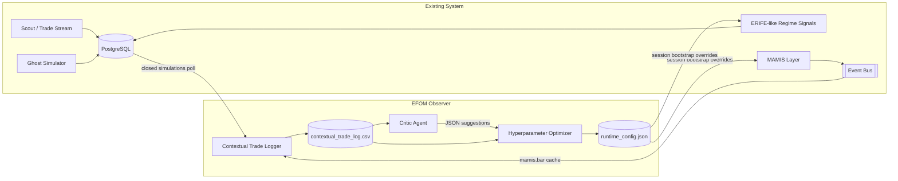

# EFOM Architecture

Observer kuralı korunur:
- MAMIS ve ERIFE çekirdek sınıfları değiştirilmez.
- EFOM kapanan işlemleri veritabanından, mikro-yapı bağlamını mevcut event bus akışından dinler.
- Optimizasyon çıktısı bir runtime config dosyasına yazılır ve yeni oturum başlangıcında dışarıdan yüklenir.